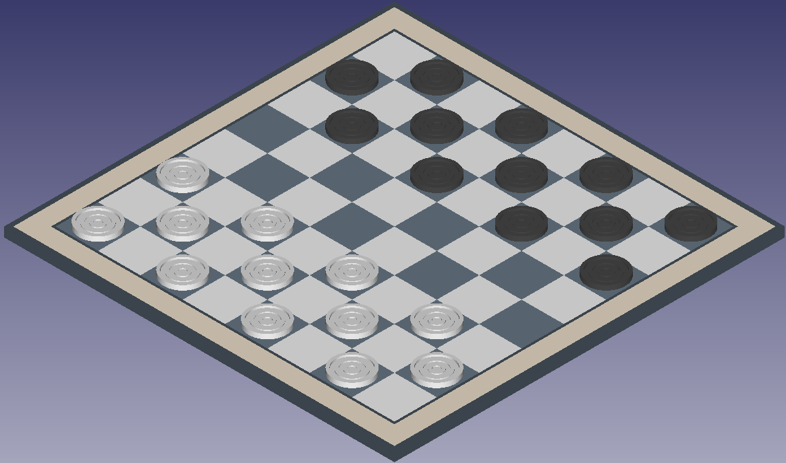
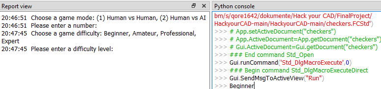

# Checkers Board Game

# Description

This is the final project for the module Foundations of CAD with FreeCAD and Python at the Bauhaus University Weimar in the wintersemester 2022/23. 
A completely functional version of the classic boardgame Checkers has been implemented in FreeCAD using only the available Python libraries.
It has been worked on by Morris Florek, matr. nr. 124437, and Henrik Norderhus, matr. nr. 123917, both students of the master program Digital Engineering.

The idea was to determine, whether an open-source CAD program can be repurposed to function as a simplistic gaming platform. 
To fulfill this goal, the focus was put on the programming aspect, leading to a modelling:programming ratio of 20:80. Besides this, the project should reflect the lessons learnt throughout the students master's program, especially the respective FreeCAD course.

# How-to 

* To play the Checkers game, first download the .FCStd file and the Python files from the src folder. 
* Open the .FCStd file and copy the Python scripts to your local Freecad's scripting folder, this should be a hidden folder under User/AppData/Roaming/FreeCAD/Macro. 
* Copy the Python files into the folder, making sure that no other Python scripts with the same name exist that directory.
* In FreeCAD, open the MaCros window and select the main.py script. Click execute. Make sure that under View -> Panels you have selected both Report View and Python Console.

* Switch to the checkers.FCStd-tab, the game is now running. The Report View will tell you about the necessary input in the Python console. 
* !! In the beginning you need to select whether you want to play against a human adversary or against the computer. If you select "2", the computer, then you will need to select the difficulty in the next step, as instructed in the Report View. Make sure to manually delete the 2 from the console since no new input prompt will be generated and make sure to spell the difficulty setting correctly. Please note also that on the highest difficulty the computer will take 2 to 3 seconds before responding with their next moves !! 

* You always start as white. Select a piece by mouseclicking and confirm your selection by pressing the "S" key on your keyboard. If the selected piece should have legal moves available then those fields will be highlighted in green. Select one of the available options again by a single left mouseclick and confirm the selection by hitting the "S" key again. The computer will respond accordingly or your opponent needs to take control of the mouse and keyboard for their move.
If you want to cancel the game, press the ESC key.
* When the game ends, the winner will be printed to the console. If you wanna start the next game, simply execute the main.py again.
* Should there be any questions about the basic rules of Checkers please refer to this short explanatory video: https://www.youtube.com/watch?v=ScKIdStgAfU&t=1s 

# UML

# Minimax algorithm

The computer's AI is realized by having the Minimax algorithm implemented. 

It is used to determine the optimal move for a player in a two-player, zero-sum game where both players have perfect information. Zero-sum means that the gain of one player is the loss of the other player. Perfect information means that both players know the state of the game at any given time.

The algorithm works by creating a tree of all possible moves and outcomes, starting from the current state of the game. Each node in the tree represents a state of the game, and the edges represent the moves that lead from one state to another.

The algorithm recursively evaluates the tree, alternating between maximizing the score for the current player and minimizing the score for the opponent player. The score is calculated using a heuristic function that estimates the likelihood of winning from the given state.

At the bottom of the tree, where the game ends, the score is known, either a win, loss, or draw. The algorithm backtracks from the bottom of the tree to the root, updating the scores of the parent nodes with the maximum or minimum of their children's scores depending on whether the current player is trying to maximize or minimize their score.

Finally, the algorithm returns the move that leads to the node with the highest score for the current player.

The different difficulties offered by the game differ in their depth-evaluating of the tree. The lowest difficulty looks ahead to the next rank, the highest looks four ranks ahead.

# Reflection

When starting out with finding a suitable idea for the final project, the first drafts were quickly discarded since there already were too many implementations and solutions. 

While the initial idea to have a game realized inside FreeCAD seemed underwhelming at first, it quickly became evident that it actually yielded a lot of potential to genuinely create a unique project while requiring a strong coding effort. 

Most problems we encountered during our work were FreeCAD specific. Beginning by it not having a proper IDE to receiving error statements which are not true Pythonic, such as "Unknown C++ error encountered" or having to research new programming approaches since FreeCAD's interpreter does not support while-loops. 
One of the biggest problems were how to work with the free camera, object selection and calculation of object movement. The final approach by combining mouse clicking and keyboard entering was deemed the most effective, but not most intuitive. The object selection problem was solved by exporting the initial body to a .obj-file to have it selected entirely by a single click.

These are just examples of hurdles we came across in our work. Eventually things came well together and we are proud of our work, deeming it appropriate for Master students. 

In conclusion, FreeCAD might be intuitive at first glance but diving deeper into modifying it, quickly many obstacles and hurdles become evident, which turned out much more time-consuming than expected. While it was tedious to work with it, we are glad to having worked with a open-source program on a deeper level. 

# Work packages

### Visuals

- [x] Create board
- [x] Create tokens
- [x] Create king tokens

### Coding

- [x] **Determine code structure**
  - [x] Create a class for a Piece
  - [x] Create a class for the Board
  - [x] Create a class for the Game
  - [x] Create a class for the playing (Play)
- [x] **Implement game logic**
  - [x] Move and remove pieces
  - [x] Get legal moves for a selected piece
  - [x] Turn a piece into a king piece
  - [x] Change turn after a move
  - [x] Check if a player has won
- [X] **Implement playability**
  - [x] Select and move pieces with mouse and keyboard commands
  - [x] Highlight fields the pieces can move to
  - [X] Change visibility of pieces and king pieces depending on the state of the piece
  - [X] Reset piece positions before starting a new game
- [X] **AI implementation**
  - [X] Implement Minimax algorithm
  - [X] Implement different difficulty levels

# References
[1] FreeCAD Wiki (2022), Pivy, accessed 28 January 2023, https://wiki.freecad.org/Pivy  
[2] FreeCAD Wiki (2023), Code snippets, 2.13 Observe mouse events in the 3D viewer via Python, accessed 07 February 2023, https://wiki.freecad.org/Code_snippets#Observing_mouse_events_in_the_3D_viewer_via_Python  
[3] techwithtim (2022), Python-Checkers-AI, accessed 05 February 2023, https://github.com/techwithtim/Python-Checkers-AI
